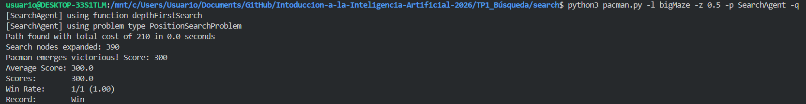
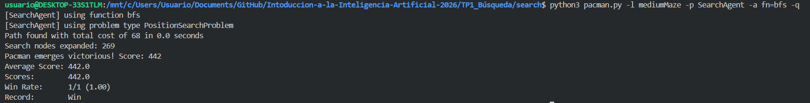
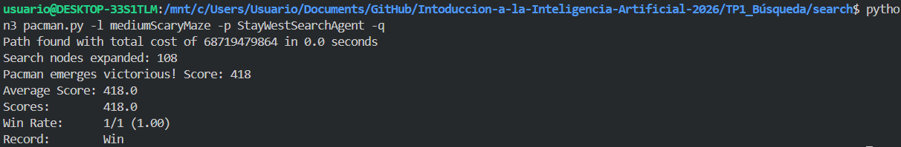
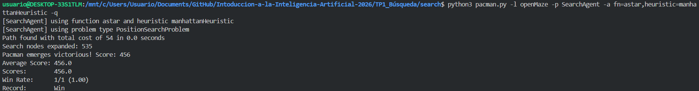
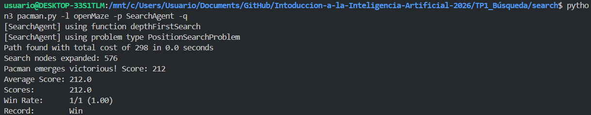
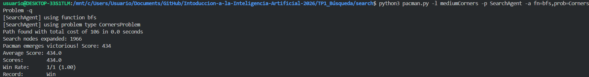
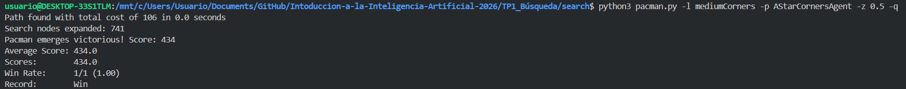
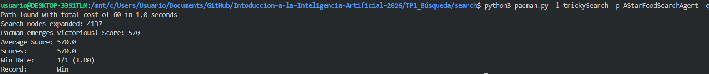

# Trabajo Práctico 1
## Representación y Búsqueda en Espacio de Estados

Introducción a la Inteligencia Artificial - LCC 2026

Integrantes: Ignacio Basualdo, Lautaro Capezio y Luciano Duarte

## Ejercicio 1: Depth-First Search

Para `depthFirstSearch` implementamos una búsqueda en profundidad sobre grafos. Utilizamos una pila (`Stack`) como frontera, donde cada elemento contiene un estado y el camino de acciones necesario para alcanzarlo. Además, mantenemos un conjunto de estados visitados para evitar expansiones repetidas.

El criterio de funcionamiento es el habitual de DFS: se extrae el estado más recientemente agregado, se verifica si es meta, y en caso contrario se apilan sus sucesores no visitados. Este enfoque no garantiza optimalidad, pero sí encuentra una solución si existe.

Respecto del orden de exploración, observamos que coincide con lo esperado para DFS: el algoritmo profundiza rápidamente por una rama antes de retroceder y explorar alternativas. Pac-Man no necesariamente recorre todas las casillas exploradas, porque el conjunto de estados expandidos representa el proceso de búsqueda, no el camino final efectivamente ejecutado.

Resultados obtenidos:

- `tinyMaze`: costo 10, 15 nodos expandidos.
- `mediumMaze`: costo 130, 146 nodos expandidos.
- `bigMaze`: costo 210, 390 nodos expandidos.

## Ejercicio 2: Breadth-First Search

Para `breadthFirstSearch` utilizamos una cola (`Queue`) como frontera. Cada elemento de la cola almacena un estado y el camino para llegar hasta él. Marcamos un estado como visitado al momento de encolarlo, lo cual evita duplicados y garantiza que la primera vez que alcanzamos un estado lo hacemos mediante el camino más corto en cantidad de acciones.

En este problema, donde todos los costos de transición son unitarios, BFS devuelve una solución óptima respecto de la longitud del camino. Esto se evidencia al compararlo con DFS: BFS encuentra recorridos sensiblemente más cortos, aunque a costa de expandir más nodos.

Resultados obtenidos:

- `mediumMaze`: costo 68, 269 nodos expandidos.
- `bigMaze`: costo 210, 620 nodos expandidos.

Conclusión del ejercicio:

- DFS no encuentra necesariamente la solución de menor costo.
- BFS sí encuentra la solución de menor costo cuando todas las acciones tienen costo uniforme, como ocurre en `PositionSearchProblem`.

## Ejercicio 3: Uniform Cost Search

Para `uniformCostSearch` implementamos una cola de prioridad (`PriorityQueue`) ordenada por costo acumulado `g(n)`. A diferencia de BFS, en este caso no basta con marcar estados al descubrirlos, porque un mismo estado puede alcanzarse luego con menor costo. Por eso, llevamos un diccionario `best_costs` con el menor costo conocido para cada estado y descartamos entradas obsoletas de la frontera.

Este detalle es importante para preservar la optimalidad en problemas de búsqueda sobre grafos con costos no uniformes. En otras palabras, nuestra implementación permite reinsertar un estado si aparece un camino mejor hacia él.

Resultados obtenidos:

- `mediumMaze`: costo 68, 269 nodos expandidos.
- `mediumDottedMaze` con `StayEastSearchAgent`: costo 1, 186 nodos expandidos.
- `mediumScaryMaze` con `StayWestSearchAgent`: costo 68719479864, 108 nodos expandidos.

Análisis:

- En `mediumMaze`, UCS coincide con BFS porque todas las acciones cuestan 1.
- En `mediumDottedMaze`, la función de costo `1 / 2^x` favorece fuertemente las posiciones del Este. Por eso el agente elige caminos que se desplazan hacia la derecha del tablero, incluso si geométricamente no parecen los más directos.
- En `mediumScaryMaze`, la función `2^x` penaliza de forma exponencial avanzar hacia el Este. Como consecuencia, Pac-Man prefiere recorridos que permanecen lo más al Oeste posible, y por eso aparece un costo total extremadamente alto si el camino obliga a internarse hacia zonas costosas.

## Ejercicio 4: A*

Para `aStarSearch` utilizamos la misma estructura general que en UCS, pero priorizando cada nodo por `f(n) = g(n) + h(n)`, donde `h(n)` es una heurística. Al igual que en UCS, nuestra implementación mantiene el mejor costo conocido por estado y permite reabrir nodos si aparece un camino más barato.

Probamos A* sobre `PositionSearchProblem` usando la heurística Manhattan provista por la cátedra. Dicha heurística es admisible y consistente en este contexto, ya que nunca sobreestima la distancia restante al objetivo y además satisface la desigualdad triangular respecto del costo unitario de cada paso.

Resultados obtenidos:

- `bigMaze` con `manhattanHeuristic`: costo 210, 549 nodos expandidos.

Comparado con UCS en el mismo problema, A* expande menos nodos, porque la heurística orienta la búsqueda hacia la meta sin perder optimalidad.

### Sobre el desempate por path-cost en A*

El enunciado pide analizar bajo qué condiciones importa desempatar nodos repetidos por costo de camino. La respuesta depende del tipo de heurística y del modelo de búsqueda:

- En búsqueda sobre árboles, una heurística admisible alcanza para garantizar optimalidad de A*.
- En búsqueda sobre grafos, la admisibilidad sola no alcanza; si la heurística no es consistente, un mismo estado puede reaparecer luego con menor costo acumulado.
- En ese caso, es necesario conservar el mejor `g(n)` conocido y permitir reabrir estados cuando se descubre un camino mejor.
- Si la heurística es consistente, la primera vez que un nodo es extraído de la cola de prioridad ya se lo hace con costo óptimo, por lo que no hace falta reabrirlo.

Nuestra implementación contempla este caso general mediante el registro de mejores costos y el descarte de entradas obsoletas en la frontera.

### Análisis de `openMaze`

En `openMaze` comparamos varias estrategias de búsqueda:

- DFS: costo 298, 576 nodos expandidos.
- BFS: costo 54, 682 nodos expandidos.
- UCS: costo 54, 682 nodos expandidos.
- A* con Manhattan: costo 54, 535 nodos expandidos.

En este mapa, BFS y UCS encuentran el mismo camino óptimo porque el costo por acción es uniforme. DFS encuentra una solución válida, pero mucho peor, ya que explora ramas profundas sin información sobre la meta. A* resulta la mejor alternativa entre las óptimas, porque la heurística Manhattan es especialmente informativa en un laberinto abierto con pocos obstáculos.

## Ejercicio 5: CornersProblem

Para modelar `CornersProblem` representamos cada estado como una tupla:

- La posición actual de Pac-Man.
- Una tupla de cuatro booleanos que indica qué esquinas ya fueron visitadas.

Esta representación abstrae toda la información irrelevante para el problema, como fantasmas, comida extra o cualquier otro aspecto del `GameState`. De este modo, el espacio de estados se mantiene compacto y apto para la búsqueda.

El estado inicial se construye con la posición de Pac-Man y el vector de esquinas visitadas en `False`, salvo el caso en que Pac-Man arranque parado sobre una esquina, situación en la cual esa esquina ya se considera visitada. Un estado es meta si las cuatro esquinas fueron alcanzadas.

En `getSuccessors`, para cada movimiento legal actualizamos la posición y, si la nueva posición corresponde a una esquina, marcamos la esquina correspondiente como visitada.

Resultados obtenidos:

- `tinyCorners` con BFS: costo 28, 252 nodos expandidos.
- `mediumCorners` con BFS: costo 106, 1966 nodos expandidos.

Esta representación cumplió con lo pedido por el enunciado y evitó el uso del `GameState` completo como estado, lo cual habría deteriorado fuertemente el rendimiento.

## Ejercicio 6: Heurística para CornersProblem

La heurística implementada en `cornersHeuristic` toma la posición actual y las esquinas restantes, genera todos los órdenes posibles de visita de esas esquinas y calcula, para cada orden, la suma de distancias Manhattan:

- Desde la posición actual hasta la primera esquina del orden.
- Entre cada par consecutivo de esquinas del orden.

La heurística devuelve el mínimo de esos valores. Como quedan a lo sumo cuatro esquinas, la cantidad de permutaciones es pequeña y el cálculo resulta perfectamente manejable.

### Admisibilidad

La heurística es admisible porque reemplaza las distancias reales del laberinto por distancias Manhattan, que nunca son mayores que la longitud real del camino entre dos posiciones cuando existen paredes. Por lo tanto, el valor calculado es una cota inferior del costo real restante.

### Consistencia

La heurística también es consistente. Puede interpretarse como el costo óptimo de un problema relajado en el cual ignoramos las paredes y medimos cada tramo mediante distancia Manhattan. En ese problema relajado, moverse un paso cuesta 1 y el costo restante nunca puede disminuir en más de una unidad al pasar de un estado a un sucesor. Como nuestra heurística devuelve exactamente el mejor valor de ese problema relajado, respeta la desigualdad de consistencia. Equivalentemente, puede verse que cada orden posible de visita induce una cota consistente, y el mínimo entre dichas cotas sigue siendo consistente.

En consecuencia, la heurística cumple:

`h(n) <= c(n, a, n') + h(n')`

para todo sucesor `n'` de `n`.

Resultados obtenidos:

- `mediumCorners` con `AStarCornersAgent`: costo 106, 741 nodos expandidos.

Esto representa una mejora importante respecto de BFS, ya que se mantiene el costo óptimo pero se reduce notablemente la cantidad de expansiones.

## Ejercicio 7: Heurística para FoodSearchProblem

Para `foodHeuristic` utilizamos como heurística la máxima distancia real de laberinto (`mazeDistance`) entre la posición actual de Pac-Man y cualquiera de las comidas restantes. Además, almacenamos en caché las distancias ya calculadas dentro de `problem.heuristicInfo`, de modo de evitar recomputaciones costosas entre llamadas sucesivas.

La intuición es la siguiente: si todavía queda una comida muy lejana, necesariamente habrá que invertir al menos esa cantidad de pasos para completar el problema. Por eso, tomar la comida restante más lejana provee una buena cota inferior.

### Admisibilidad

La heurística es admisible porque la distancia real desde la posición actual hasta una comida dada no puede ser mayor que el costo real necesario para resolver el problema completo, ya que dicho costo incluye al menos llegar a esa comida.

### Consistencia

La heurística es consistente. Para cada comida fija, la función “distancia de laberinto hasta esa comida” es consistente, porque desplazarse un paso cambia a lo sumo en una unidad esa distancia. Como nuestra heurística toma el máximo entre todas esas funciones, el resultado sigue siendo consistente.

En otras palabras, el valor heurístico nunca cae más de una unidad al pasar de un estado a un sucesor, y por eso respeta la desigualdad de consistencia con costo unitario.

Resultados obtenidos:

- `testSearch` con `AStarFoodSearchAgent`: costo 7, 10 nodos expandidos.
- `trickySearch` con `AStarFoodSearchAgent`: costo 60, 4137 nodos expandidos, 2.2 segundos.

Consideramos que esta heurística logra un buen equilibrio entre calidad de guía y costo computacional. En particular, mejora significativamente respecto de heurísticas más débiles y mantiene una justificación clara de corrección.

## Verificaciones adicionales

Además de los casos exigidos por el enunciado, verificamos:

- `ClosestDotSearchAgent` sobre `tinySearch`: costo 31.
- Correcta resolución de los layouts principales sin modificar archivos distintos de `search.py` y `searchAgents.py`.
- Comportamiento correcto de UCS y A* ante estados repetidos con distintos costos acumulados.

## Conclusión

En este trabajo práctico implementamos correctamente algoritmos clásicos de búsqueda ciega e informada, junto con dos modelados de problemas más complejos dentro del entorno Pac-Man. Los resultados experimentales confirman lo esperado desde el punto de vista teórico:

- DFS encuentra soluciones rápidamente, pero no óptimas.
- BFS garantiza optimalidad cuando los costos son uniformes.
- UCS generaliza esa optimalidad a costos arbitrarios no negativos.
- A* permite reducir el número de expansiones cuando se dispone de heurísticas admisibles y consistentes.

Finalmente, las heurísticas propuestas para `CornersProblem` y `FoodSearchProblem` permitieron resolver los casos pedidos por la cátedra con buen desempeño y manteniendo las garantías de corrección necesarias para búsqueda sobre grafos.
